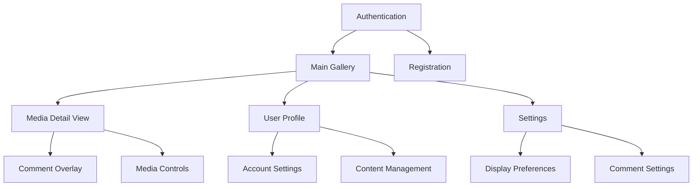
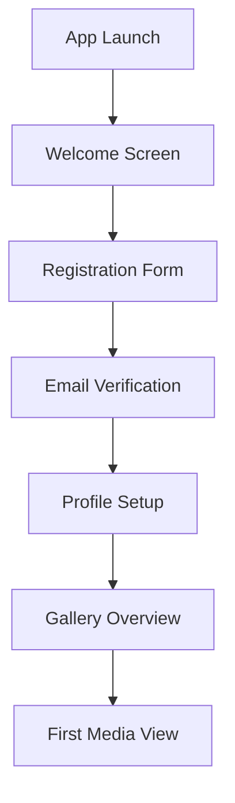
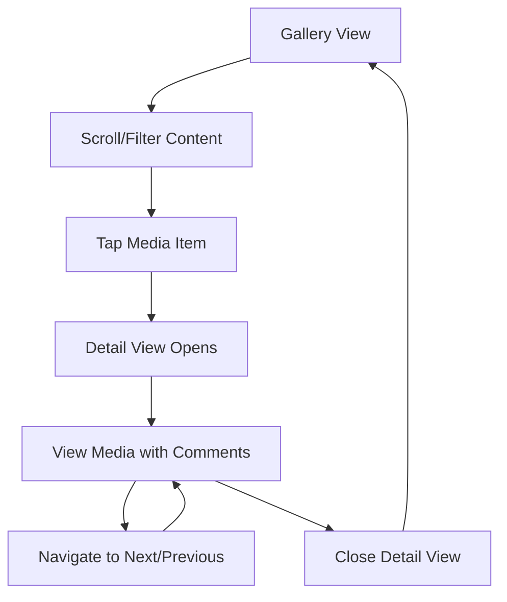
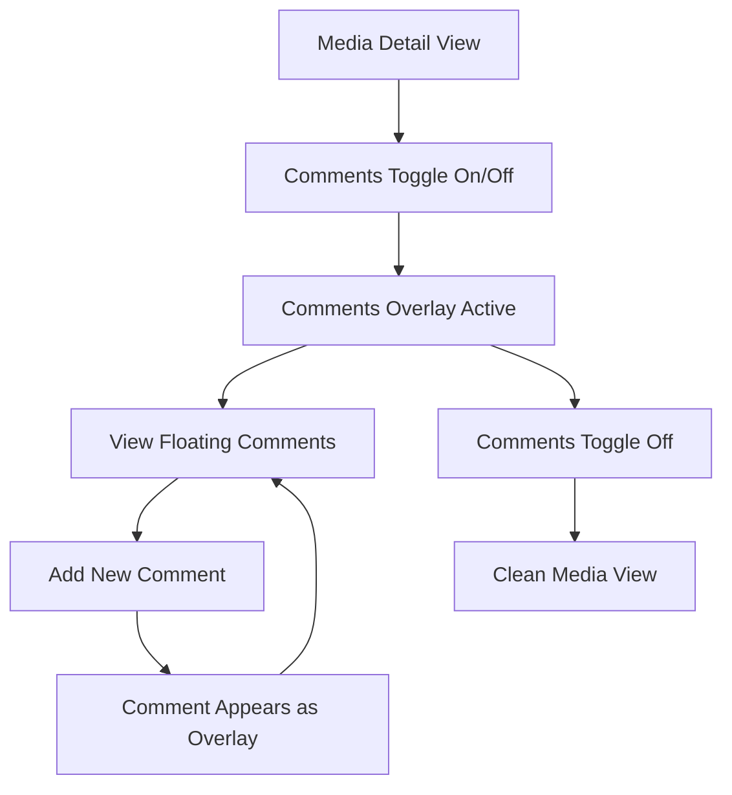

# ZViewer UI/UX Specification

## Introduction

This document defines the user experience goals, information architecture, user flows, and visual design specifications for ZViewer's user interface. It serves as the foundation for visual design and frontend development, ensuring a cohesive and user-centered experience.

### Overall UX Goals & Principles

#### Target User Personas

**Multimedia Enthusiast:** Users who enjoy viewing and sharing photos, videos, and other media content. They value visual appeal, smooth interactions, and social features like comments.

**Content Creator:** Professional or amateur creators who need to organize, manage, and showcase their multimedia content. They require efficient browsing, categorization, and management tools.

**Social Viewer:** Users who primarily consume content and engage through comments and interactions. They prioritize discovery, easy navigation, and engaging visual experiences.

#### Usability Goals

- **Visual Immersion:** Users should feel immersed in their multimedia content with beautiful, distraction-free viewing experiences
- **Intuitive Navigation:** New users can discover and navigate content within 30 seconds
- **Efficient Browsing:** Power users can quickly find and view specific content through smart organization
- **Social Engagement:** Users can easily view and interact with comments without disrupting their viewing experience
- **Performance:** Smooth 60fps animations and sub-200ms response times for all interactions

#### Design Principles

1. **Visual First** - Prioritize the multimedia content as the hero element in every interface
2. **Glassmorphism Aesthetic** - Use Apple-inspired frosted glass effects for modern, elegant backgrounds
3. **Fluid Interactions** - Smooth animations and transitions that feel natural and responsive
4. **Progressive Disclosure** - Show relevant information when needed, hide complexity when not
5. **Social Integration** - Seamlessly integrate comments and social features without cluttering the viewing experience

### Change Log

| Date | Version | Description | Author |
|------|---------|-------------|---------|
| 2024-01-XX | 1.0 | Initial UI/UX specification with glassmorphism and waterfall layouts | UX Expert |

## Information Architecture (IA)

### Site Map / Screen Inventory

### Navigation Structure

**Primary Navigation:** Bottom tab bar with Gallery, Profile, and Settings icons for easy thumb navigation

**Secondary Navigation:** Contextual actions within each screen (search, filter, sort options)

**Breadcrumb Strategy:** Simple back navigation with media count indicators (e.g., "Photo 3 of 15")

## User Flows

### Flow 1: First-time User Onboarding

**User Goal:** Create account and explore multimedia content

**Entry Points:** App launch, registration screen

**Success Criteria:** User successfully creates account and views their first media item

#### Flow Diagram

#### Edge Cases & Error Handling:
- Network connectivity issues during registration
- Invalid email format validation
- Account already exists error handling
- Profile setup incomplete scenarios

**Notes:** Focus on minimal friction while gathering essential user information

### Flow 2: Media Discovery and Viewing

**User Goal:** Browse and view multimedia content efficiently

**Entry Points:** Gallery screen, search results, shared links

**Success Criteria:** User can quickly find and view desired content with smooth interactions

#### Flow Diagram

#### Edge Cases & Error Handling:
- Large media files loading slowly
- Network interruptions during viewing
- Comment loading failures
- Media format not supported

**Notes:** Prioritize smooth transitions and provide clear loading states

### Flow 3: Comment Interaction

**User Goal:** View and interact with comments on media content

**Entry Points:** Media detail view, comment notifications

**Success Criteria:** User can view comments as overlay and add new comments easily

#### Flow Diagram

#### Edge Cases & Error Handling:
- Comment posting failures
- Inappropriate comment moderation
- Comment loading timeouts
- Real-time comment sync issues

**Notes:** Comments should enhance, not distract from the viewing experience

## Wireframes & Mockups

### Design Files

**Primary Design Files:** [Figma Design System - ZViewer](https://figma.com/zviewer-design-system)

### Key Screen Layouts

#### Authentication Screen
**Purpose:** User login and registration with elegant glassmorphism background

**Key Elements:**
- Animated frosted glass background with subtle color gradients
- Centered login/register forms with glassmorphism cards
- Smooth tab switching between login and registration
- Brand logo with subtle animation

**Interaction Notes:** Forms slide in with spring animation, background continuously shifts colors

**Design File Reference:** [Auth Screen - Figma Frame](https://figma.com/auth-screen)

#### Main Gallery Screen
**Purpose:** Waterfall layout displaying multimedia content thumbnails

**Key Elements:**
- Masonry/Pinterest-style grid layout with varying image heights
- Rounded corner thumbnails with subtle shadows
- Floating action button for adding content
- Search bar with glassmorphism styling
- Smooth infinite scroll loading

**Interaction Notes:** Images load with fade-in animation, pull-to-refresh gesture, tap to open detail view

**Design File Reference:** [Gallery Screen - Figma Frame](https://figma.com/gallery-screen)

#### Media Detail Screen
**Purpose:** Full-screen media viewing with overlay comments

**Key Elements:**
- Full-screen media display with gesture controls
- Floating comment overlay system
- Media navigation controls (previous/next)
- Comment toggle button
- Share and favorite actions

**Interaction Notes:** Pinch to zoom, swipe to navigate, tap to show/hide controls

**Design File Reference:** [Detail Screen - Figma Frame](https://figma.com/detail-screen)

## Component Library / Design System

### Design System Approach

**Design System Approach:** Custom design system built on Flutter Material 3 with glassmorphism extensions. Focus on creating reusable components that maintain the frosted glass aesthetic throughout the application.

### Core Components

#### Glassmorphism Card
**Purpose:** Primary container component for all content areas

**Variants:** 
- Standard (medium blur)
- High blur (for modals)
- Low blur (for subtle backgrounds)

**States:** Default, Hover, Pressed, Disabled

**Usage Guidelines:** Use for all major content containers, maintain consistent blur radius and transparency

#### Waterfall Grid
**Purpose:** Masonry layout for multimedia content display

**Variants:**
- 2-column (mobile)
- 3-column (tablet)
- 4-column (desktop)

**States:** Loading, Loaded, Error, Empty

**Usage Guidelines:** Maintain consistent spacing, optimize for different screen sizes

#### Comment Overlay
**Purpose:** Floating comment display system

**Variants:**
- Single comment bubble
- Comment stream
- Comment input

**States:** Visible, Hidden, Typing, Sending

**Usage Guidelines:** Position comments to avoid obscuring important content areas

#### Media Thumbnail
**Purpose:** Rounded corner image/video preview

**Variants:**
- Image thumbnail
- Video thumbnail (with play icon)
- Loading placeholder

**States:** Loading, Loaded, Error, Selected

**Usage Guidelines:** Maintain aspect ratio, use consistent corner radius

## Branding & Style Guide

### Visual Identity

**Brand Guidelines:** Modern, minimalist approach with focus on content. Clean typography, subtle animations, and glassmorphism effects create a premium feel.

### Color Palette

| Color Type | Hex Code | Usage |
|------------|----------|-------|
| Primary | #007AFF | Primary actions, links, active states |
| Secondary | #5856D6 | Secondary actions, accents |
| Accent | #FF9500 | Highlights, warnings, call-to-action |
| Success | #34C759 | Success messages, confirmations |
| Warning | #FF9500 | Warnings, important notices |
| Error | #FF3B30 | Errors, destructive actions |
| Glass Background | rgba(255,255,255,0.1) | Glassmorphism backgrounds |
| Glass Border | rgba(255,255,255,0.2) | Glassmorphism borders |

### Typography

#### Font Families
- **Primary:** SF Pro Display (iOS) / Roboto (Android)
- **Secondary:** SF Pro Text (iOS) / Roboto (Android)
- **Monospace:** SF Mono (iOS) / Roboto Mono (Android)

#### Type Scale

| Element | Size | Weight | Line Height |
|---------|------|--------|-------------|
| H1 | 32px | Bold | 1.2 |
| H2 | 24px | Semibold | 1.3 |
| H3 | 20px | Medium | 1.4 |
| Body | 16px | Regular | 1.5 |
| Small | 14px | Regular | 1.4 |

### Iconography

**Icon Library:** SF Symbols (iOS) / Material Icons (Android)

**Usage Guidelines:** Use outlined style for primary actions, filled for active states. Maintain consistent 24px base size with 2px stroke weight.

### Spacing & Layout

**Grid System:** 8px base unit with 16px, 24px, 32px, 48px, 64px spacing scale

**Spacing Scale:** Use 8px multiples for consistent spacing throughout the application

## Accessibility Requirements

### Compliance Target

**Standard:** WCAG 2.1 AA compliance with enhanced support for multimedia content

### Key Requirements

**Visual:**
- Color contrast ratios: 4.5:1 for normal text, 3:1 for large text
- Focus indicators: 2px solid outline with 2px offset
- Text sizing: Support for 200% zoom without horizontal scrolling

**Interaction:**
- Keyboard navigation: Full keyboard support for all interactive elements
- Screen reader support: Proper ARIA labels and semantic markup
- Touch targets: Minimum 44px touch target size

**Content:**
- Alternative text: Descriptive alt text for all images and media
- Heading structure: Logical heading hierarchy (H1-H6)
- Form labels: Clear, descriptive labels for all form inputs

### Testing Strategy

Automated testing with axe-core, manual testing with screen readers, and user testing with accessibility needs.

## Responsiveness Strategy

### Breakpoints

| Breakpoint | Min Width | Max Width | Target Devices |
|------------|-----------|-----------|----------------|
| Mobile | 320px | 767px | Smartphones |
| Tablet | 768px | 1023px | Tablets, small laptops |
| Desktop | 1024px | 1439px | Laptops, desktops |
| Wide | 1440px | - | Large monitors |

### Adaptation Patterns

**Layout Changes:** 
- Mobile: Single column gallery, bottom navigation
- Tablet: 2-3 column gallery, side navigation
- Desktop: 3-4 column gallery, top navigation

**Navigation Changes:**
- Mobile: Bottom tab bar with 3-4 main sections
- Tablet: Side navigation rail with expanded labels
- Desktop: Top navigation bar with dropdown menus

**Content Priority:**
- Mobile: Focus on media viewing, minimal UI chrome
- Tablet: Balanced view with more metadata
- Desktop: Full feature set with additional controls

**Interaction Changes:**
- Mobile: Touch gestures, swipe navigation
- Tablet: Touch and mouse support
- Desktop: Mouse and keyboard optimized

## Animation & Micro-interactions

### Motion Principles

- **Purposeful:** Every animation serves a functional purpose
- **Smooth:** 60fps performance with spring-based easing
- **Consistent:** Use consistent timing and easing curves
- **Accessible:** Respect reduced motion preferences

### Key Animations

- **Page Transitions:** 300ms spring animation with 0.2 damping
- **Card Interactions:** 150ms ease-out for hover states
- **Comment Overlay:** 200ms slide-up with fade-in
- **Media Loading:** 400ms fade-in with scale animation
- **Glassmorphism Shifts:** 2s continuous subtle color transitions

## Performance Considerations

### Performance Goals

- **Page Load:** < 2 seconds for initial gallery load
- **Interaction Response:** < 100ms for all user interactions
- **Animation FPS:** Consistent 60fps for all animations

### Design Strategies

- Lazy loading for media thumbnails
- Progressive image loading with blur-to-sharp transitions
- Optimized glassmorphism effects using GPU acceleration
- Efficient comment overlay rendering with object pooling

## Next Steps

### Immediate Actions

1. Create detailed Figma mockups for all key screens
2. Develop glassmorphism component library in Flutter
3. Implement waterfall grid layout with performance optimization
4. Build comment overlay system with real-time updates
5. Conduct user testing with prototype

### Design Handoff Checklist

- [x] All user flows documented
- [x] Component inventory complete
- [x] Accessibility requirements defined
- [x] Responsive strategy clear
- [x] Brand guidelines incorporated
- [x] Performance goals established

## Checklist Results

UI/UX specification complete with focus on glassmorphism design, waterfall layouts, and innovative comment overlay system. Ready for development handoff and visual design creation.