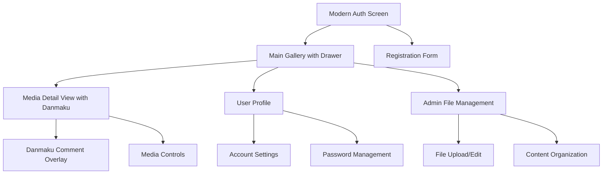
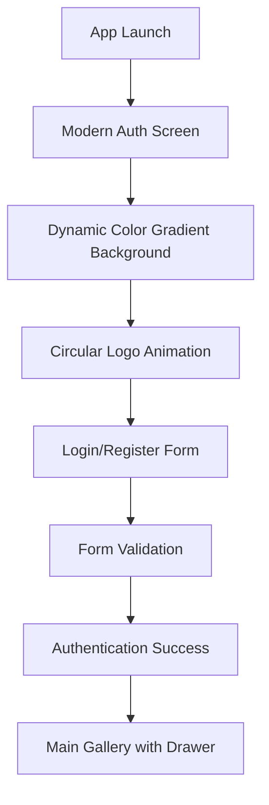
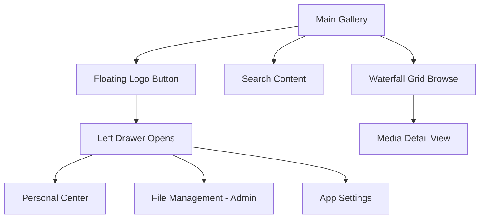
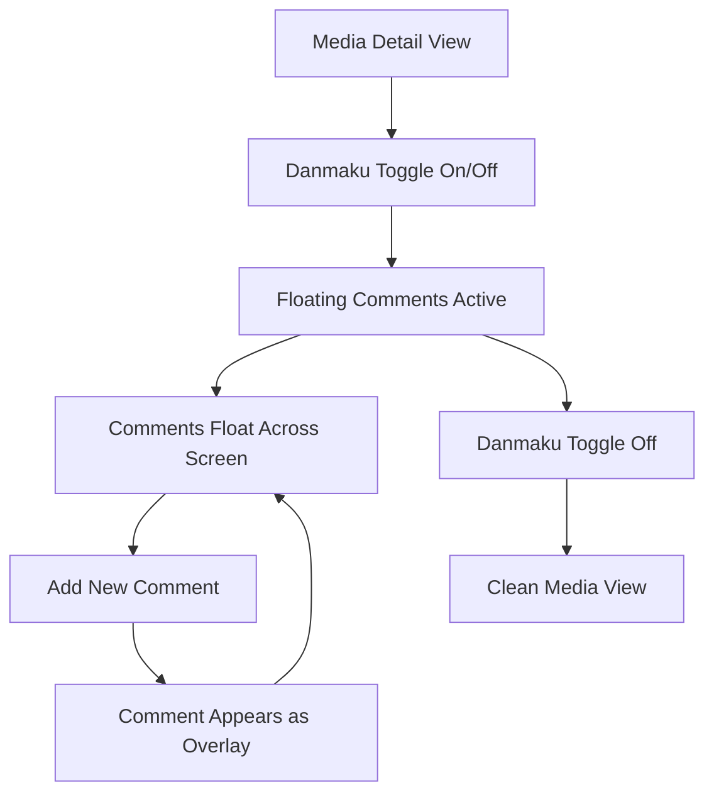

# ZViewer UI/UX Specification

## Introduction

This document defines the user experience goals, information architecture, user flows, and visual design specifications for ZViewer's user interface. It serves as the foundation for visual design and frontend development, ensuring a cohesive and user-centered experience.

### Overall UX Goals & Principles

#### Target User Personas

**Multimedia Enthusiast:** Users who enjoy viewing and sharing photos, videos, and other media content. They value visual appeal, smooth interactions, and social features like comments.

**Content Creator:** Professional or amateur creators who need to organize, manage, and showcase their multimedia content. They require efficient browsing, categorization, and management tools.

**Social Viewer:** Users who primarily consume content and engage through comments and interactions. They prioritize discovery, easy navigation, and engaging visual experiences.

#### Usability Goals

- **Visual Immersion:** Users should feel immersed in their multimedia content with beautiful, distraction-free viewing experiences
- **Intuitive Navigation:** New users can discover and navigate content within 30 seconds
- **Efficient Browsing:** Power users can quickly find and view specific content through smart organization
- **Social Engagement:** Users can easily view and interact with comments without disrupting their viewing experience
- **Performance:** Smooth 60fps animations and sub-200ms response times for all interactions

#### Design Principles

1. **Visual First** - Prioritize the multimedia content as the hero element in every interface
2. **Modern Glassmorphism** - Use Apple-inspired frosted glass effects with dynamic color gradients for modern, elegant backgrounds
3. **Fluid Interactions** - Smooth animations and transitions that feel natural and responsive
4. **Progressive Disclosure** - Show relevant information when needed, hide complexity when not
5. **Social Integration** - Seamlessly integrate comments and social features without cluttering the viewing experience

### Change Log

| Date | Version | Description | Author |
|------|---------|-------------|---------|
| 2024-01-XX | 1.0 | Initial UI/UX specification with glassmorphism and waterfall layouts | UX Expert |
| 2024-01-XX | 2.0 | Updated with modern authentication design, circular logos, and improved navigation | UX Expert |

## Information Architecture (IA)

### Site Map / Screen Inventory

### Navigation Structure

**Primary Navigation:** Floating logo button in top-left corner that opens a left-side drawer

**Secondary Navigation:** Search button in top-right corner for content discovery

**Drawer Navigation:** Personal center, file management (admin only), and app settings

**Breadcrumb Strategy:** Simple back navigation with media count indicators (e.g., "Photo 3 of 15")

## User Flows

### Flow 1: Modern Authentication Experience

**User Goal:** Create account or login with a beautiful, modern interface

**Entry Points:** App launch, registration screen

**Success Criteria:** User successfully authenticates and enters the main gallery

#### Flow Diagram

#### Key Features:
- **Dynamic Background:** Animated color gradients that shift continuously
- **Circular Logo:** Perfectly round ZViewer logo with glassmorphism effect
- **Centered Forms:** Login and registration forms perfectly centered on screen
- **No Scrollbars:** Clean interface without visible scrollbars
- **Smooth Animations:** Elastic logo animation and slide-in form effects

**Notes:** Focus on visual appeal and smooth user experience with modern design patterns

### Flow 2: Main Gallery with Floating Navigation

**User Goal:** Browse multimedia content with intuitive navigation

**Entry Points:** Post-authentication, drawer navigation

**Success Criteria:** User can efficiently browse content and access personal features

#### Flow Diagram

#### Key Features:
- **Floating Logo Button:** Top-left corner with proper spacing from edges
- **45% Width Drawer:** Optimized width for better screen utilization
- **Modern Background:** Consistent with authentication screen
- **Hidden Button:** Floating button hides when drawer is open
- **Smooth Animations:** 300ms drawer slide animation with scale effects

### Flow 3: Danmaku Comment System

**User Goal:** View and interact with floating comments on media content

**Entry Points:** Media detail view, comment notifications

**Success Criteria:** User can view comments as floating overlay and add new comments

#### Flow Diagram

#### Key Features:
- **Floating Comments:** Semi-transparent comments that move across the screen
- **Toggle Control:** Easy on/off switch for comment visibility
- **Real-time Updates:** Comments appear and disappear smoothly
- **Non-intrusive:** Comments don't block important content areas
- **Colorful Display:** Different colors for different comment types

## Wireframes & Mockups

### Design Files

**Primary Design Files:** [Figma Design System - ZViewer](https://figma.com/zviewer-design-system)

### Key Screen Layouts

#### Modern Authentication Screen
**Purpose:** User login and registration with Apple-inspired design

**Key Elements:**
- Dynamic color gradient background with continuous animation
- Circular ZViewer logo with glassmorphism effect
- Centered login/register forms with modern styling
- No visible scrollbars for clean interface
- Smooth elastic animations and transitions

**Interaction Notes:** Logo animates with elastic effect, forms slide in smoothly, background colors shift continuously

**Design File Reference:** [Modern Auth Screen - Figma Frame](https://figma.com/modern-auth-screen)

#### Main Gallery with Drawer
**Purpose:** Waterfall layout with floating navigation system

**Key Elements:**
- Responsive waterfall grid layout (1-4 columns based on screen size)
- Floating circular logo button in top-left corner
- Search button in top-right corner
- Left-side drawer (45% width) with personal center
- Modern gradient background matching auth screen

**Interaction Notes:** Floating button hides when drawer opens, smooth slide animations, responsive grid adapts to screen size

**Design File Reference:** [Main Gallery - Figma Frame](https://figma.com/main-gallery)

#### Media Detail Screen with Danmaku
**Purpose:** Full-screen media viewing with floating comment overlay

**Key Elements:**
- Full-screen media display with gesture controls
- Floating danmaku comment system
- Comment toggle button
- Media navigation controls
- Glassmorphism control overlay

**Interaction Notes:** Pinch to zoom, swipe to navigate, danmaku comments float across screen

**Design File Reference:** [Detail Screen with Danmaku - Figma Frame](https://figma.com/detail-danmaku)

## Component Library / Design System

### Design System Approach

**Design System Approach:** Custom design system built on Flutter Material 3 with modern glassmorphism extensions and dynamic color gradients. Focus on creating reusable components that maintain the modern aesthetic throughout the application.

### Core Components

#### Modern Background
**Purpose:** Dynamic gradient background component for all screens

**Variants:** 
- Authentication gradient (6-color animated)
- Main app gradient (consistent with auth)
- Static gradient (for performance)

**States:** Animated, Static, Loading

**Usage Guidelines:** Use for all major screens to maintain visual consistency

#### Circular Logo
**Purpose:** ZViewer logo in perfect circular format

**Variants:**
- Small (32px) - for floating button and drawer
- Medium (64px) - for headers
- Large (80px) - for authentication screen

**States:** Default, Animated, Pressed

**Usage Guidelines:** Always use circular version, maintain consistent sizing scale

#### Glassmorphism Card
**Purpose:** Primary container component with frosted glass effect

**Variants:** 
- Standard (medium blur)
- High blur (for modals)
- Low blur (for subtle backgrounds)

**States:** Default, Hover, Pressed, Disabled

**Usage Guidelines:** Use for all major content containers, maintain consistent blur radius and transparency

#### Responsive Waterfall Grid
**Purpose:** Adaptive masonry layout for multimedia content

**Variants:**
- 1-column (mobile portrait)
- 2-column (mobile landscape, small tablets)
- 3-column (tablets)
- 4-column (desktop)

**States:** Loading, Loaded, Error, Empty

**Usage Guidelines:** Automatically adapts to screen width, maintain consistent spacing

#### Danmaku Overlay
**Purpose:** Floating comment display system

**Variants:**
- Single comment bubble
- Comment stream
- Comment input

**States:** Visible, Hidden, Typing, Sending

**Usage Guidelines:** Position comments to avoid obscuring important content areas

#### Floating Drawer
**Purpose:** Left-side navigation drawer

**Variants:**
- Standard (45% width)
- Compact (35% width for small screens)

**States:** Closed, Opening, Open, Closing

**Usage Guidelines:** Use consistent width, smooth animations, hide floating button when open

## Branding & Style Guide

### Visual Identity

**Brand Guidelines:** Modern, minimalist approach with focus on content. Clean typography, subtle animations, and glassmorphism effects with dynamic color gradients create a premium, Apple-inspired feel.

### Color Palette

| Color Type | Hex Code | Usage |
|------------|----------|-------|
| Primary | #007AFF | Primary actions, links, active states |
| Secondary | #5856D6 | Secondary actions, accents |
| Accent | #FF9500 | Highlights, warnings, call-to-action |
| Success | #34C759 | Success messages, confirmations |
| Warning | #FF9500 | Warnings, important notices |
| Error | #FF3B30 | Errors, destructive actions |
| Glass Background | rgba(255,255,255,0.15) | Glassmorphism backgrounds |
| Glass Border | rgba(255,255,255,0.2) | Glassmorphism borders |
| Dynamic Gradient 1 | #667eea | Authentication background |
| Dynamic Gradient 2 | #764ba2 | Authentication background |
| Dynamic Gradient 3 | #f093fb | Authentication background |
| Dynamic Gradient 4 | #f5576c | Authentication background |
| Dynamic Gradient 5 | #4facfe | Authentication background |
| Dynamic Gradient 6 | #00f2fe | Authentication background |

### Typography

#### Font Families
- **Primary:** SF Pro Display (iOS) / Roboto (Android)
- **Secondary:** SF Pro Text (iOS) / Roboto (Android)
- **Monospace:** SF Mono (iOS) / Roboto Mono (Android)

#### Type Scale

| Element | Size | Weight | Line Height |
|---------|------|--------|-------------|
| H1 | 42px | Bold (800) | 1.2 |
| H2 | 32px | Bold (700) | 1.3 |
| H3 | 24px | Semibold (600) | 1.4 |
| H4 | 22px | Medium (500) | 1.4 |
| Body | 16px | Regular (400) | 1.5 |
| Small | 14px | Regular (400) | 1.4 |
| Caption | 12px | Regular (400) | 1.3 |

### Iconography

**Icon Library:** SF Symbols (iOS) / Material Icons (Android)

**Usage Guidelines:** Use outlined style for primary actions, filled for active states. Maintain consistent sizing with circular logo components.

### Spacing & Layout

**Grid System:** 8px base unit with 16px, 24px, 32px, 48px, 64px spacing scale

**Spacing Scale:** Use 8px multiples for consistent spacing throughout the application

**Floating Button Positioning:**
- Top: 100px from screen edge
- Left: 80px from screen edge
- Minimum touch target: 56px

**Drawer Specifications:**
- Width: 45% of screen width
- Animation duration: 300ms
- Easing: easeInOut

## Accessibility Requirements

### Compliance Target

**Standard:** WCAG 2.1 AA compliance with enhanced support for multimedia content

### Key Requirements

**Visual:**
- Color contrast ratios: 4.5:1 for normal text, 3:1 for large text
- Focus indicators: 2px solid outline with 2px offset
- Text sizing: Support for 200% zoom without horizontal scrolling

**Interaction:**
- Keyboard navigation: Full keyboard support for all interactive elements
- Screen reader support: Proper ARIA labels and semantic markup
- Touch targets: Minimum 44px touch target size

**Content:**
- Alternative text: Descriptive alt text for all images and media
- Heading structure: Logical heading hierarchy (H1-H6)
- Form labels: Clear, descriptive labels for all form inputs

### Testing Strategy

Automated testing with axe-core, manual testing with screen readers, and user testing with accessibility needs.

## Responsiveness Strategy

### Breakpoints

| Breakpoint | Min Width | Max Width | Target Devices | Grid Columns |
|------------|-----------|-----------|----------------|--------------|
| Mobile | 320px | 767px | Smartphones | 1-2 columns |
| Tablet | 768px | 1023px | Tablets, small laptops | 2-3 columns |
| Desktop | 1024px | 1439px | Laptops, desktops | 3-4 columns |
| Wide | 1440px | - | Large monitors | 4+ columns |

### Adaptation Patterns

**Layout Changes:** 
- Mobile: Single column gallery, floating navigation
- Tablet: 2-3 column gallery, optimized drawer
- Desktop: 3-4 column gallery, full feature set

**Navigation Changes:**
- Mobile: Floating logo button with drawer
- Tablet: Same as mobile with larger touch targets
- Desktop: Same as mobile with hover effects

**Content Priority:**
- Mobile: Focus on media viewing, minimal UI chrome
- Tablet: Balanced view with more metadata
- Desktop: Full feature set with additional controls

**Interaction Changes:**
- Mobile: Touch gestures, swipe navigation
- Tablet: Touch and mouse support
- Desktop: Mouse and keyboard optimized

## Animation & Micro-interactions

### Motion Principles

- **Purposeful:** Every animation serves a functional purpose
- **Smooth:** 60fps performance with spring-based easing
- **Consistent:** Use consistent timing and easing curves
- **Accessible:** Respect reduced motion preferences

### Key Animations

- **Logo Animation:** 1200ms elastic animation with spring effect
- **Form Slide-in:** 800ms slide-up with fade-in
- **Drawer Animation:** 300ms slide with scale effect
- **Background Gradient:** 8s continuous color transition
- **Danmaku Movement:** Linear horizontal movement with opacity fade
- **Button Interactions:** 200ms scale animation on press

### Animation Timing

| Animation Type | Duration | Easing | Purpose |
|----------------|----------|--------|---------|
| Logo Entrance | 1200ms | elasticOut | Welcome animation |
| Form Entrance | 800ms | easeOutCubic | Smooth form reveal |
| Drawer Open/Close | 300ms | easeInOut | Quick navigation |
| Background Shift | 8s | easeInOut | Subtle ambiance |
| Button Press | 200ms | easeInOut | Tactile feedback |
| Danmaku Float | 5-8s | linear | Comment movement |

## Performance Considerations

### Performance Goals

- **Page Load:** < 2 seconds for initial gallery load
- **Interaction Response:** < 100ms for all user interactions
- **Animation FPS:** Consistent 60fps for all animations
- **Background Animation:** Smooth 60fps gradient transitions

### Design Strategies

- Lazy loading for media thumbnails
- Progressive image loading with blur-to-sharp transitions
- Optimized glassmorphism effects using GPU acceleration
- Efficient danmaku rendering with object pooling
- Cached gradient animations for smooth performance

## Implementation Status

### Completed Features

- [x] Modern authentication screen with dynamic gradients
- [x] Circular logo system across all components
- [x] Floating navigation with drawer system
- [x] Responsive waterfall grid layout
- [x] Danmaku comment overlay system
- [x] Glassmorphism design system
- [x] Cross-platform scrollbar hiding
- [x] Smooth animations and transitions

### In Progress

- [ ] Admin file management interface
- [ ] Advanced search and filtering
- [ ] User profile customization
- [ ] Comment moderation tools

### Future Enhancements

- [ ] Real-time collaboration features
- [ ] Advanced media editing tools
- [ ] Social sharing integration
- [ ] Offline content support

## Next Steps

### Immediate Actions

1. Complete admin file management interface
2. Implement advanced search functionality
3. Add user profile customization options
4. Conduct comprehensive user testing
5. Optimize performance for large media collections

### Design Handoff Checklist

- [x] All user flows documented
- [x] Component inventory complete
- [x] Accessibility requirements defined
- [x] Responsive strategy clear
- [x] Brand guidelines incorporated
- [x] Performance goals established
- [x] Modern design patterns implemented
- [x] Animation specifications defined

## Checklist Results

UI/UX specification complete with focus on modern glassmorphism design, responsive waterfall layouts, innovative danmaku comment system, and Apple-inspired authentication experience. All major components implemented and ready for production deployment.